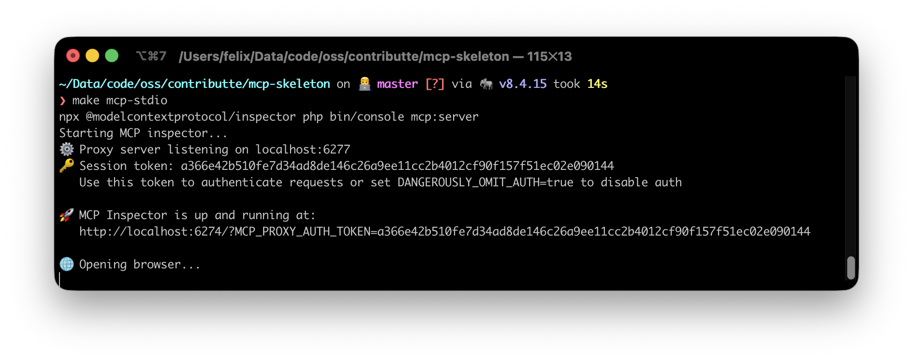
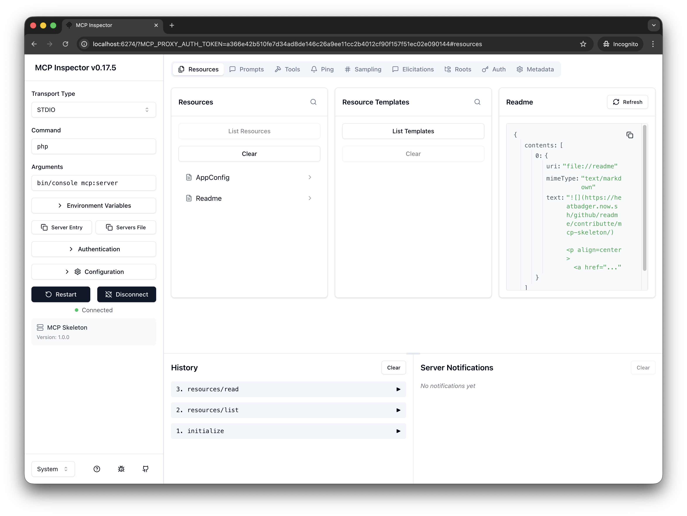
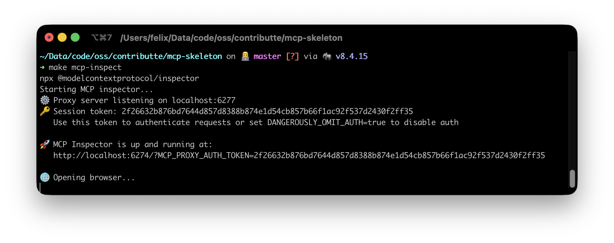
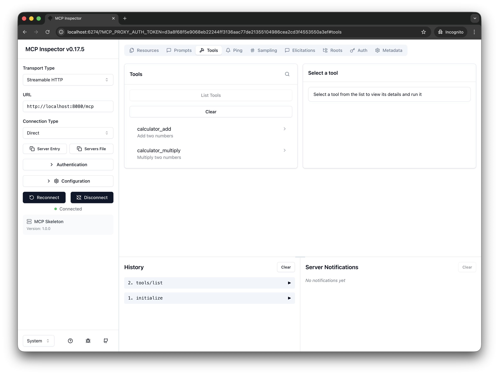

<p align=center>
  <a href="https://github.com/contributte/mcp-skeleton/actions"></a>
  <a href="https://coveralls.io/r/contributte/mcp-skeleton"></a>
  <a href="https://packagist.org/packages/contributte/mcp-skeleton"></a>
  <a href="https://packagist.org/packages/contributte/mcp-skeleton"></a>
</p>
<p align=center>
  <a href="https://packagist.org/packages/contributte/mcp-skeleton"></a>
  <a href="https://github.com/contributte/mcp-skeleton"></a>
  <a href="https://bit.ly/ctteg"></a>
  <a href="https://bit.ly/cttfo"></a>
  <a href="https://contributte.org/partners.html"></a>
</p>

<p align=center>
Website 🚀 <a href="https://contributte.org">contributte.org</a> | Contact 👨🏻‍💻 <a href="https://f3l1x.io">f3l1x.io</a> | Twitter 🐦 <a href="https://twitter.com/contributte">@contributte</a>
</p>

-----

# MCP Skeleton

Example project demonstrating integration of **Model Context Protocol (MCP)** for **Nette Framework** using `contributte/mcp`.

The MCP integration is based on the upstream documentation: [contributte/mcp docs](https://github.com/contributte/mcp/tree/master/.docs).


## Requirements

- PHP 8.4+
- Composer
- Node.js (only for MCP inspector via `npx`)

## Installation

```bash
composer install
```

## Usage

This skeleton registers a single MCP server named `default` and uses **attribute auto-discovery** from `app/Domain/Mcp`.

**Capabilities:**

- Tools:
  - `calculator_add`
  - `calculator_multiply`
- Resources:
  - `app://config`
  - `file://readme`
- Resource templates:
  - `app://users/{id}`
- Prompts:
  - `code_review`
  - `explain_code`

### Streamable HTTP server

1. Start inspector: `make inspector`
2. Open the inspector in your browser and connect to `http://localhost:8080/mcp`.

#### Manual

1. Start inspector: `make inspector` (or `make mcp-stdio` to auto-run the STDIO server)
2. Open the inspector in your browser and do work.

## Screenshots

### STDIO





### Streamable HTTP






## Development

See [how to contribute](https://contributte.org/contributing.html) to this package.

This package is currently maintaining by these authors.

<a href="https://github.com/f3l1x">
    
</a>

-----

Consider to [support](https://contributte.org/partners.html) **contributte** development team. Also thank you for using this project.
