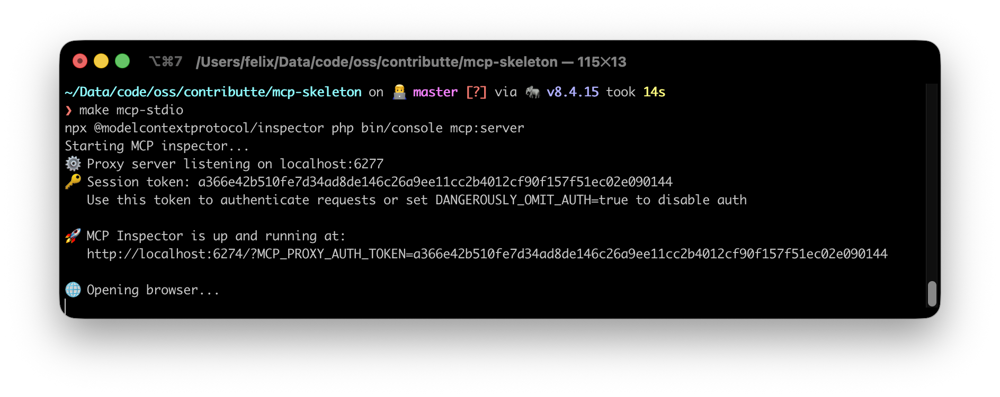
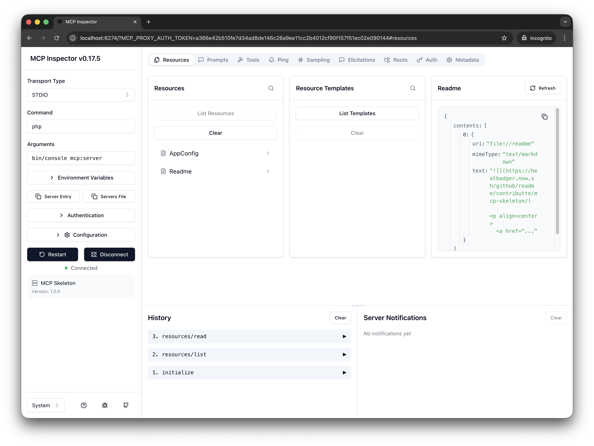
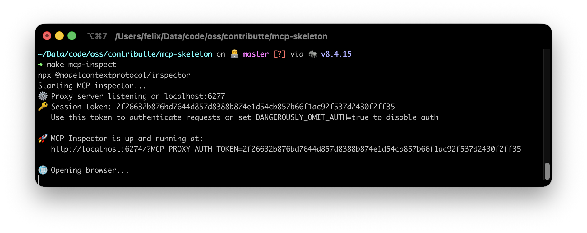
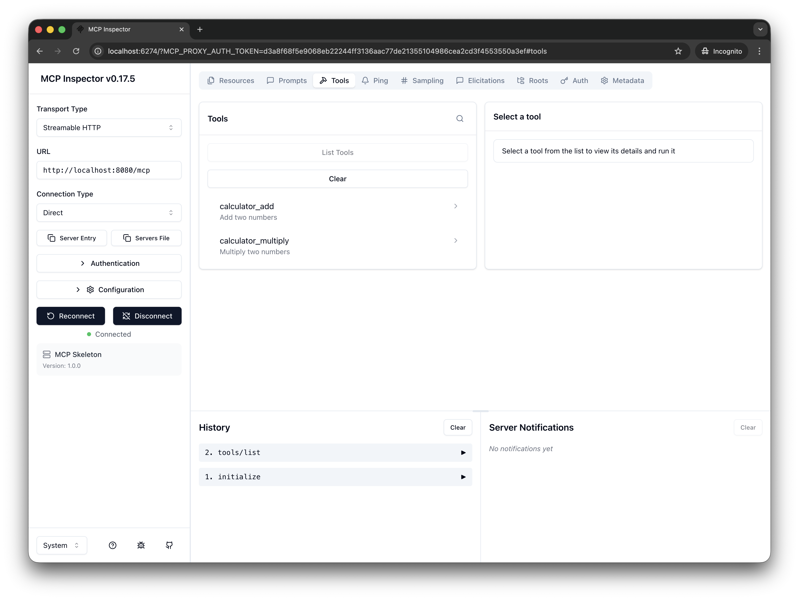

# MCP Skeleton

A Composer project skeleton demonstrating Model Context Protocol (MCP) integration with the Nette Framework through [`contributte/mcp`](https://github.com/contributte/mcp/tree/master/.docs).

<p align="center">
  <a href="https://github.com/contributte/mcp-skeleton/actions"></a>
  <a href="https://codecov.io/gh/contributte/mcp-skeleton"></a>
  <a href="https://packagist.org/packages/contributte/mcp-skeleton"></a>
  <a href="https://github.com/contributte/mcp-skeleton"></a>
</p>


## Quick Start

**Requirements:** PHP 8.4 or later, Composer, Node.js, and `npx` for the MCP Inspector.

Create a project. `composer create-project` installs its dependencies; do not run `composer install` again.

```bash
composer create-project contributte/mcp-skeleton my-mcp-server
cd my-mcp-server
```

Create the ignored local configuration file, then prepare the writable Nette cache and log directories:

```bash
make init
make setup
```

Start the stdio MCP server through the Inspector:

```bash
make mcp-stdio
```

The Inspector starts the repository's `php bin/console mcp:server` command as its stdio server. In the Inspector, connect to that launched stdio server, then call `calculator_add` with:

```json
{
  "a": 1,
  "b": 2
}
```

Repository-backed, unexecuted behavior: the tool returns the integer `3`.

The skeleton discovers MCP attributes in `app/Domain/Mcp` for its `default` server. It includes calculator tools, resources, a user resource template, and code-review prompts. No database, migration, fixture, or credential setup is tracked for this example. Local overrides belong in the ignored `config/local.neon`, created from `config/local.neon.example`.

## HTTP Endpoint

The application routes an MCP HTTP endpoint at `/mcp`. The tracked development recipe starts PHP at `http://localhost:8080`, but it does not provide a router script for PHP's built-in server; therefore a clean-checkout HTTP MCP procedure cannot be safely documented from the tracked recipes. Use the stdio route above, or configure a compatible web server with `www/` as its document root and its supplied rewrite rules.

## Verification

Run the repository test suite:

```bash
make tests
```

## Screenshots

### Stdio





### Streamable HTTP





## Contributing

This is a [Contributte](https://contributte.org) project. See [Contributte's contribution guide](https://contributte.org/contributing.html) and the [repository](https://github.com/contributte/mcp-skeleton) for the contribution route.

## License

Copyright 2025 Contributte. Released under the [MIT License](LICENSE).
